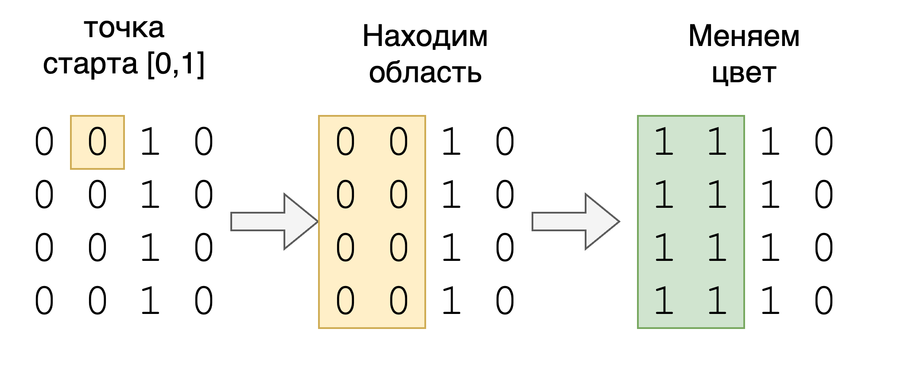

# ДЗ

Требуется реализовать методы в `Matrix.h`, и проверить их тестами `MatrixTest.cpp`

Запуск тестов:

Скомпилировать `MatrixTest.cpp` и запустить.

## 1. Раскрашивание матрицы

★★★☆☆

Дана двухцветная матрица, состоящая из 0 и 1, а также произвольная
точка с координатами [row, col]. Метод должен изменить все ячейки области в которой находится точка на значение newColor.

```cpp
static std::vector<std::vector<int>> paint(const std::vector<std::vector<int>>& image, int row, int col, int newColor)
```

Например, для матрицы:

```text
image = [[0, 0, 1, 0],
         [0, 0, 1, 0],
         [0, 0, 1, 0],
         [0, 0, 1, 0]]
row = 0
col = 1
newColor = 1
```

надо закрасить область из 0, в которой располагается точка (0, 1)
единицами. Область ограничивается границами массива, и прилегающими
ячейками отличающего цвета от цвета стартовой точки (0,1) по вертикали
и горизонтале. Тогда результат окрашивания будет выглядить так:

```text
image = [[1, 1, 1, 0],
         [1, 1, 1, 0],
         [1, 1, 1, 0],
         [1, 1, 1, 0]]
```

Пример пошагово:



## 2. Острова

★★★★☆

Для двумерного массива размером MxN, состоящего из единиц, которые
обозначают сушу, и нулей, обозначающих воду. Верните количество островов.

Остров окружён водой и образован соединением соседних земель по
горизонтали и вертикали. Вы можете предположить, что все четыре
края матрицы окружены водой.

```cpp
static int numIslands(const std::vector<std::vector<char>>& grid)
```
